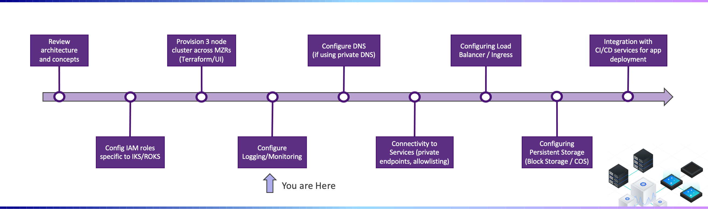

---

copyright:
  years: 2022
lastupdated: "2022-02-21"

subcollection: cloud-native-journey

---

{{site.data.keyword.attribute-definition-list}}

# Logging and monitoring
{: #cloud-native-logging-monitoring}

## Journey Map
{: #cloud-native-logging-monitoring-map}

{: class="center"}

Set up logging and monitoring in {{site.data.keyword.containerlong_notm}} to help you troubleshoot issues and improve the health and performance of your Kubernetes clusters and apps.

Continuous monitoring and logging is the key to detecting attacks on your cluster and troubleshooting issues as they arise. By continuously monitoring your cluster, you're able to better understand your cluster capacity and the availability of resources that are available to your app. With this insight, you can prepare to protect your apps against downtime.

## Forward cluster and app logs to {{site.data.keyword.loganalysisshort_notm}}
{: #cloud-native-logging-forward-logs}

Use the {{site.data.keyword.containerlong_notm}} observability plug-in to create a logging configuration for {{site.data.keyword.loganalysisshort_notm}} in your cluster, and use this logging configuration to automatically collect and forward pod logs to {{site.data.keyword.loganalysislong_notm}}.

- [Forward logs to an {{site.data.keyword.loganalysislong_notm}} instance](https://{DomainName}/docs/containers?topic=containers-health#logging)

## Forward cluster and app metrics to {{site.data.keyword.monitoringlong_notm}}
{: #cloud-native-monitoring-forward-logs}

Use the {{site.data.keyword.containerlong_notm}} observability plug-in to create a monitoring configuration for {{site.data.keyword.monitoringlong_notm}} in your cluster, and use this monitoring configuration to automatically collect and forward metrics to {{site.data.keyword.monitoringlong_notm}}.

- [Forward metrics to an {{site.data.keyword.monitoringlong_notm}} instance](https://{DomainName}/docs/containers?topic=containers-health-monitor#monitoring)

## Forward Kubernetes API audit logs to {{site.data.keyword.loganalysisshort_notm}}
{: #cloud-native-logging-forward-audit-logs}

To forward audit logs to {{site.data.keyword.loganalysislong_notm}}, you can [create a Kubernetes audit system by using the provided image and deployment](https://{DomainName}/docs/containers?topic=containers-health-audit#audit-api-server-la).

## Next Steps
{: #cloud-native-prepare-account-next-steps}

The next step on the deployment journey is:
* [Configure DNS](/docs/cloud-native-journey?topic=cloud-native-journey-configure-dns)