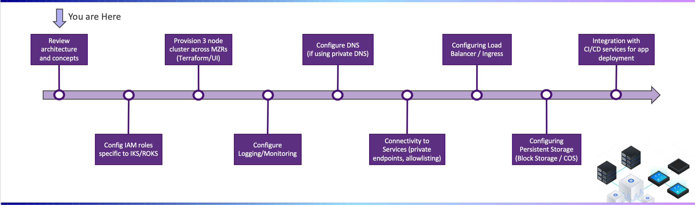

---

copyright:
  years: 2022
lastupdated: "2022-02-18"

subcollection: cloud-native-journey

---

{{site.data.keyword.attribute-definition-list}}

# Deployment Journey Overview
{: #cloud-native-overview}

{{site.data.keyword.containerlong_notm}} is a managed offering to create your own Kubernetes cluster of compute hosts to deploy and manage containerized apps on {{site.data.keyword.Bluemix_notm}}. As a certified Kubernetes provider, {{site.data.keyword.containerlong_notm}} provides intelligent scheduling, self-healing, horizontal scaling, service discovery and load balancing, automated rollouts and rollbacks, and secret and configuration management for your apps. Combined with an intuitive user experience, built-in security and isolation, and advanced tools to secure, manage, and monitor your cluster workloads, you can rapidly deliver highly available and secure containerized apps in the public cloud.
{: shortdesc}

Welcome to the Deployment Journey for Cloud Native on {{site.data.keyword.Bluemix_notm}}! Use the sidebar on the left to navigate between the journey points.
{: tip}

## Journey Map
{: #cloud-native-overview-map}

{: class="center"}

## Assumptions
{: #cloud-native-overview-assumptions}

This deployment guide  will be assuming the following points. Please note that while your circumstance may not be exactly identical, you will still benefit from the overall journey steps and concepts covered in this guide.

- You are already familar with the concepts introduced in the "Tour {{site.data.keyword.Bluemix_notm}}" videos available on the [Getting Started with {{site.data.keyword.Bluemix_notm}}](https://{DomainName}/cloud/get-started)  page.

- Access groups will need to be defined so only certain users have the ability to create and manage the VPC network settings (i.e. CIDR ranges, Subnet ACLs rules, etc.).

## Understanding {{site.data.keyword.Bluemix_notm}} VPC Concepts
{: #cloud-native-overview-concepts}

{: video output="iframe" data-script="none" id="youtubeplayer" frameborder="0" webkitallowfullscreen mozallowfullscreen allowfullscreen}

## Next Steps
{: #cloud-native-overview-next-steps}

The next step on the deployment journey is:
* [Prepare your {{site.data.keyword.Bluemix_notm}} account](/docs/cloud-native-journey?topic=cloud-native-journey-cloud-native-prepare-account)

