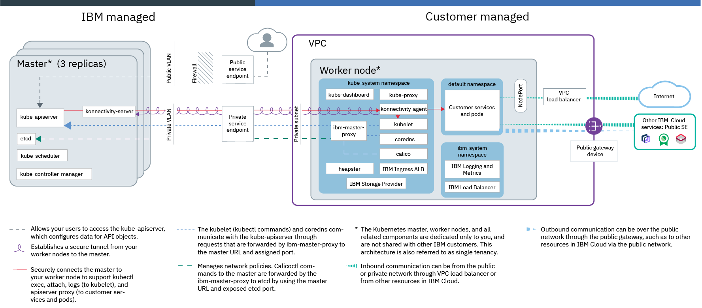

---

copyright:
  years: 2022
lastupdated: "2022-03-03"

subcollection: cloud-native-journey

---

{{site.data.keyword.attribute-definition-list}}

# Deployment Journey Overview
{: #cloud-native-overview}

{{site.data.keyword.containerlong_notm}}(IKS) is a managed offering to create your own Kubernetes cluster of compute hosts to deploy and manage containerized apps on {{site.data.keyword.Bluemix_notm}}. As a certified Kubernetes provider, {{site.data.keyword.containerlong_notm}} provides intelligent scheduling, self-healing, horizontal scaling, service discovery and load balancing, automated rollouts and rollbacks, and secret and configuration management for your apps. Combined with an intuitive user experience, built-in security and isolation, and advanced tools to secure, manage, and monitor your cluster workloads, you can rapidly deliver highly available and secure containerized apps in the public cloud.
{: shortdesc}

Welcome to the Deployment Journey for Cloud Native on {{site.data.keyword.Bluemix_notm}}! Use the sidebar on the left to navigate between the journey points.
{: tip}

## Journey Map
{: #cloud-native-overview-map}

{: class="center"}

## Assumptions
{: #cloud-native-overview-assumptions}

This deployment guide will be assuming the following points. Please note that while your circumstance may not be exactly identical, you will still benefit from the overall journey steps and concepts covered in this guide.

- You are already familar with the concepts introduced in the "Tour {{site.data.keyword.Bluemix_notm}}" videos available on the [Getting Started with {{site.data.keyword.Bluemix_notm}}](https://{DomainName}/cloud/get-started)  page.

- Access groups will need to be defined so only certain users have the ability to create and manage the VPC network settings (i.e. CIDR ranges, Subnet ACLs rules, etc.).

- When you create your cluster, you must choose a VPC networking setup so that certain cluster components can communicate with each other and with networks or services outside of the cluster.

  * Worker-to-worker communication: All worker nodes must be able to communicate with each other on the private network through VPC subnets.
  * Worker-to-master and user-to-master communication: Your worker nodes and your authorized cluster users can communicate with the Kubernetes master securely over virtual private endpoints or cloud service endpoints.
  * Worker communication to other services or networks: Allow your worker nodes to securely communicate with other {{site.data.keyword.cloud_notm}} services, such as {{site.data.keyword.registrylong}}, to on-premises networks, to other VPCs, or to classic infrastructure resources.
  * External communication to apps that run on worker nodes: Allow public or private requests into the cluster as well as requests out of the cluster to a public endpoint.

- Understanding of [{{site.data.keyword.containerlong_notm}}](https://{DomainName}/docs/containers?topic=containers-iks-overview#service-concepts)

- Components that are set up in an {{site.data.keyword.containerlong_notm}} [VPC cluster architecture](https://{DomainName}/docs/containers?topic=containers-service-arch#architecture_vpc)

  

## Next Steps
{: #cloud-native-overview-next-steps}

The next step on the deployment journey is:
* [Prepare your {{site.data.keyword.Bluemix_notm}} account](/docs/cloud-native-journey?topic=cloud-native-journey-cloud-native-prepare-account)

