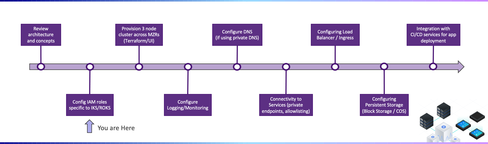
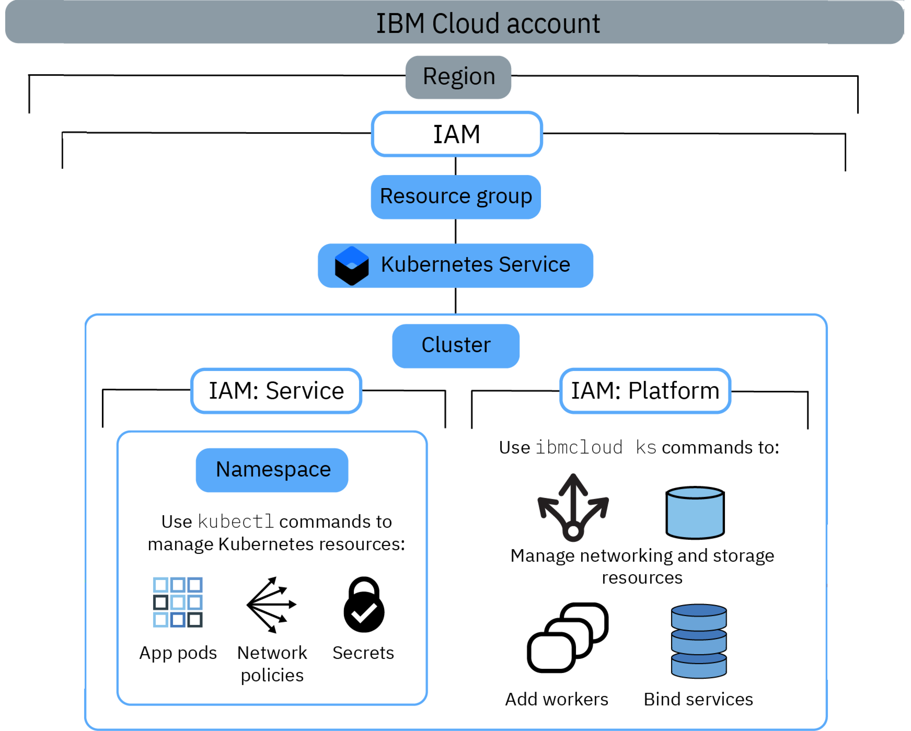

---

copyright:
  years: 2022, 2023
lastupdated: "2022-03-09"

subcollection: cloud-native-journey

---

{{site.data.keyword.attribute-definition-list}}

# Prepare your IBM Cloud account
{: #cloud-native-prepare-account}

## Journey Map
{: #cloud-native-prepare-account-map}

{: class="center"}

## Setup Resource Group
{: #cloud-native-prepare-account-resource-group}

Resource Groups allow you to organize the resources/instances into groups (i.e. ProjectA_Resources, ProjectB_Resources, Dev_Env, Prod_Env, etc.), and can be used as part of the access management strategy (i.e. Developers granted access to resources in Dev_Env resourcce group but no access to Prod_env). When a {{site.data.keyword.containerlong_notm}} is provisioned, it must be placed within a resource group. Please refer to the follow assets to understand the best practices for using resource groups:

- [Best practices for resource groups and assigning access](/docs/account?topic=account-account_setup)

## User access permissions
{: #cloud-native-prepare-account-permissions}

When you assign cluster permissions, it can be hard to judge which role you need to assign to a user. Use the tables in the following links to determine the minimum level of permissions that are required to perform common tasks in {{site.data.keyword.containerlong_notm}}.

- [Permissions to create a cluster](https://{DomainName}/docs/containers?topic=containers-access_reference#cluster_create_permissions)
- [IBM Cloud IAM platform access roles](https://{DomainName}/docs/containers?topic=containers-access_reference#iam_platform)
- [IBM Cloud IAM service access roles](https://{DomainName}/docs/containers?topic=containers-access_reference#service)
- [Kubernetes resource permissions per RBAC role](https://{DomainName}/docs/containers?topic=containers-access_reference#rbac_ref)

The following image shows the different types of permissions and roles, the actions a role can perform, and how the roles relate to each other.

Additionally, check [getting started with IAM and Virtual Private Cloud (VPC)](https://{DomainName}/docs/vpc?topic=vpc-iam-getting-started).

## Next Steps
{: #cloud-native-prepare-account-next-steps}

The next step on the deployment journey is:
* [Provision a cluster](/docs/cloud-native-journey?topic=cloud-native-journey-cloud-native-provision-cluster)