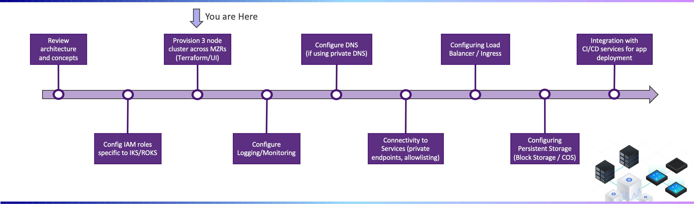

---

copyright:
  years: 2022
lastupdated: "2022-03-08"

subcollection: cloud-native-journey

---

{{site.data.keyword.attribute-definition-list}}

# Provision cluster
{: #cloud-native-roks-provision-cluster}

## Journey Map
{: #cloud-native-roks-provision-cluster-map}

{: class="center"}

## Overview
{: #cloud-native-roks-provision-cluster-overview}

Provisioning of a standard IKS cluster on VPC can be accomplished via the IBM Cloud Portal User Interface, IBM Cloud CLI, or via Terraform. 

If you are brand new to {{site.data.keyword.Bluemix_notm}}, a [video](https://www.youtube.com/watch?v=MPPAitYizkk) showing how to use {{site.data.keyword.Bluemix_notm}} UI to create a Kubernetes cluster may be a good first step to orient yourself around some of the concepts.  However, as you start to create multiple clusters and want to leverage consistent repeatable patterns, you'll find Terraform automation to be more efficient.
{: tip}

### Import IKS-VPC Terraform Code to Schematics
{: #cloud-native-roks-provision-create-schematics-workspace}

1. Login to {{site.data.keyword.Bluemix_notm}} and navigate to the IBM Schematics service as shown in the figure below: 
   

2. From the Schematics Workspace tab, choose to create a new project workspace. 

3. Schematics can automatically pull terraform code from a GitHub repo. Enter `https://github.com/IBM-Cloud/cloud-journey/tree/main/IKS` as the repository URL (which represents the VPC architecture depicted above) and select **terraform_v1.0**.
    

4. Specify the workspace details values based on your preferences. 

   As a best practice, do NOT use the "default" resource group.  Create a resource group for this network or project provides more flexibility. For additional details see the [Preparing Your {{site.data.keyword.Bluemix_notm}} Account](/docs/vpc-journey?topic=vpc-journey-vpc-prep-account) page of this deployment journey guide.
   {: tip}

5. Validate the information entered and click on **Create** to retrieve the Terraform code and create the Schematics workspace.

### Configure Terraform Variables
{: #cloud-native-roks-provision-config-schematics}  

1. If not already there, navigate to the **Settings** page of your new Schematics workspace where you will see a list of variables (and their default values) which were found in the Terraform code.

2. Enter a value for the {{site.data.keyword.Bluemix_notm}} API Key variable (if it exists) by clicking on the action menu.
   

   The API key is the credential the terraform code will run under and may we associated with a userid or a serviceid. To generate an API Key, click on Manage (located in top menu bar), select IAM, and then API keys. When entering the value in Schematics, be sure to select the `Sensitive` checkbox.
   {: tip}

3. Inspect the remaining variables and update the values for `vpc-name`, `resource_group`, and other variables as needed. For example, you will most likely need to update the resource group name.

   Refer to the readme which accompanies the Terraform code for descriptions on variable names and their usage. In this example, you will see variables for configuring the subnet tiers, whether or not public gateways for a zone are enabled, subnet acl rules, etc.
   {: tip}

### Apply IKS-VPC Terraform Code
{: #cloud-native-roks-provision-apply-schematics}  

1. Click the **Generate plan** to validate the configuration. This is similar to running `terraform plan` when using the CLI. No changes will be made nor any resources deployed. This will only perform a test run. 
   

2. If the generate action completes successfully, click on **Apply plan** button to provision this cloud native configuration.  

3. Once the apply plan completes successfully, click on the menu icon (located in the top left corner) and navigate to the Kubernetes page to browse your newly created cluster! 

4. (Optional) If you would like to delete/destroy the resources which was created, go back to the Schematics Workspace and select Actions > Destroy Resources. 

## Next Steps
{: #cloud-native-roks-provision-cluster-next-steps}

The next step on the deployment journey is:
* [Logging and monitoring](/docs/cloud-native-journey?topic=cloud-native-journey-cloud-native-logging-monitoring)