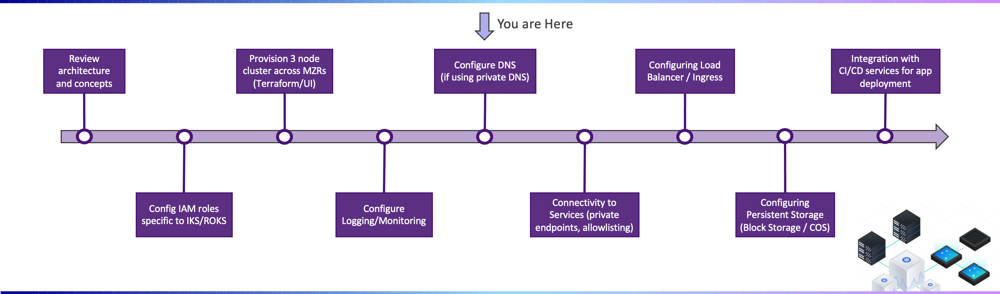
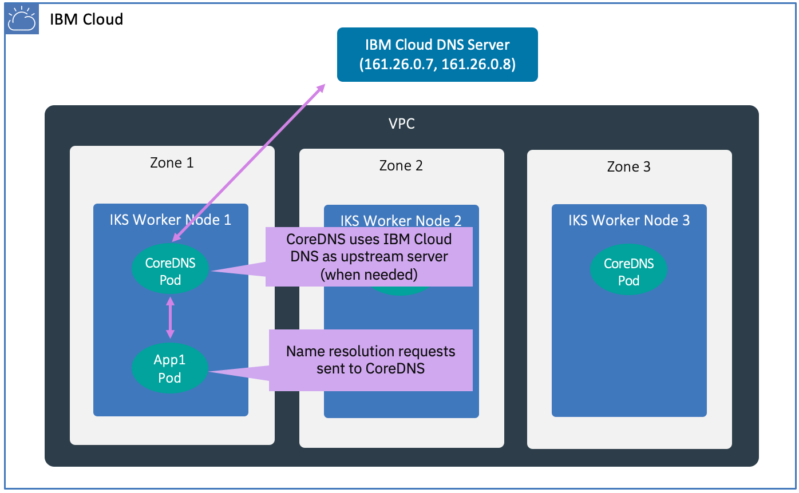

---

copyright:
  years: 2022, 2023
lastupdated: "2022-03-09"

subcollection: cloud-native-journey

---

{{site.data.keyword.attribute-definition-list}}

# Configure DNS
{: #cloud-native-roks-configure-dns}

## Journey Map
{: #cloud-native-roks-configure-dns-map}

{: class="center"}

## Overview 
{: #cloud-native-roks-configure-dns-overview}

Application pods in your IKS Cluster uses CoreDNS as its DNS provider. If CoreDNS is unable to resolve a DNS request, it forwards the the request to the IBM Cloud Private DNS. In some circumstances, you may choose to customize the DNS settings, such as needing to integrate with a private on-prem DNS for accessing on-prem resources. In this section of the journey, we will review some of these scenarios.

The process which loads images from a container registry is configured to use the IBM Cloud DNS Server and does not use CoreDNS. If you will be using a private on-prem container registry, be sure to refer to the section below to configure the IBM Cloud DNS Server.
{: tip}

{: class="center"}

## On-Prem Private DNS 
{: #cloud-native-roks-configure-dns-onprem}

If your IBM Cloud Account is connected to your on-prem network and if your application will be referencing private on-prem hostnames, you will need to configure CoreDNS. As shown in the figure below, the CoreDNS configuration is extended so if any queries for the private acme.com domain are received, CoreDNS will forward the request to an on-prem private DNS Server. 

To configure CoreDNS to use your on-prem private DNS Server, following the steps described in "[Customizing the cluster DNS provider](https://{DomainName}/docs/containers?topic=containers-cluster_dns#dns_customize)" section of the documentation.

The [VPC Onboarding Journey](/docs/vpc-journey) contains information on VPC Networking and establishing connectivity with On-Prem.
{: tip}

{: class="center"}

