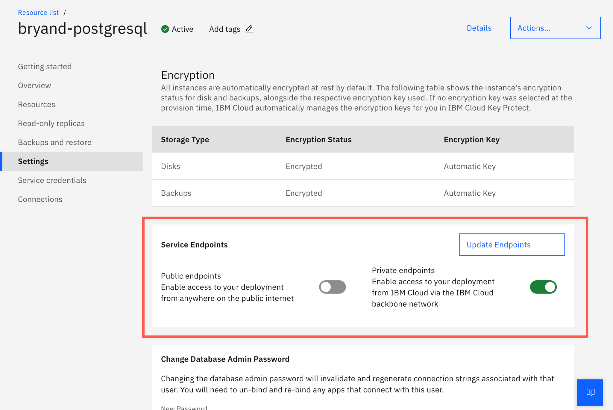
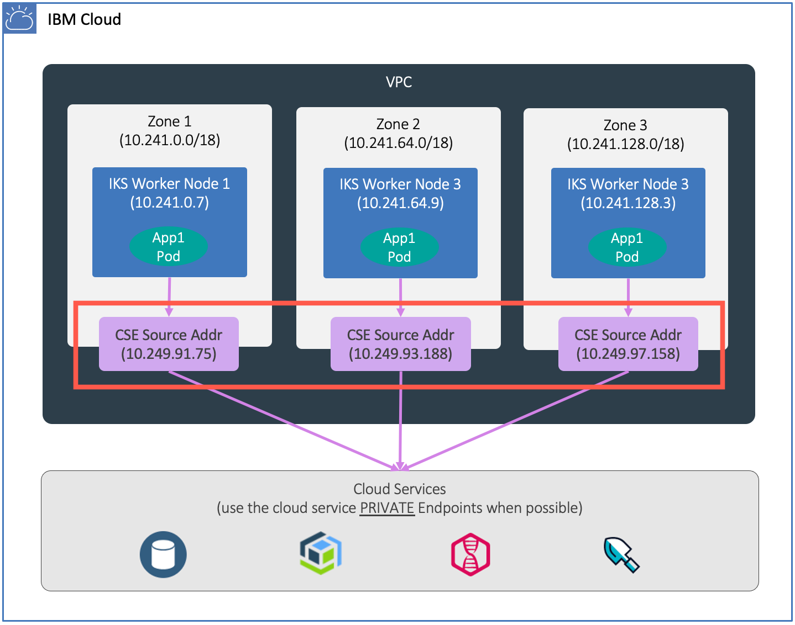
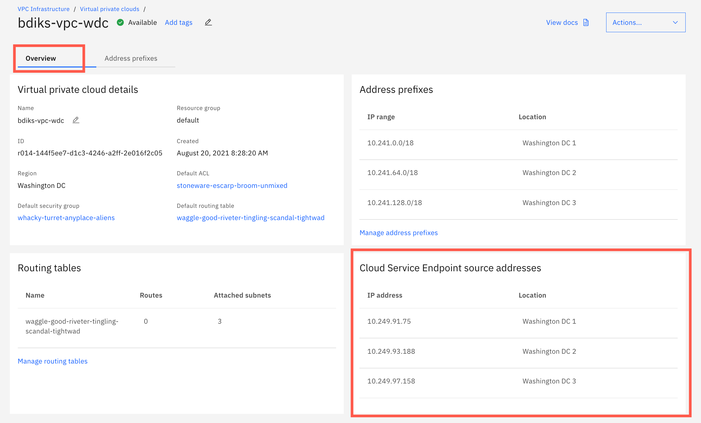

---

copyright:
  years: 2022, 2023
lastupdated: "2022-03-14"

subcollection: cloud-native-journey

---

{{site.data.keyword.attribute-definition-list}}

# Connectivity to services
{: #cloud-native-roks-service-connectivity}

## Journey Map
{: #cloud-native-roks-service-connectivity-map}

{: class="center"}

## Overview 
{: #cloud-native-roks-service-connectivity-overview}

In a typical deployment, your application will leverage one or more IBM Cloud services (i.e. PostgreSQL, Redis, Cloud Object Storage, Logging, etc.). In this section of the journey, we will cover connecting to these services and securing those connections.

## Public vs Private Endpoints 
{: #cloud-native-roks-service-connectivity-endpoints}

When creating/configuring a cloud service, you will see two types of connection endpoints - public and private. The recommended way to connect to the service is via it's PRIVATE endpoint. Doing so will use the IBM private backbone for communication and provides the benefit of no data transfer fees. Public endpoints are internet facing and should NOT be enabled unless required (and may incur data transfer fees).

{: class="center"}

## Allowlisting via Cloud Service Endpoints (CSEs) 
{: #cloud-native-roks-service-connectivity-cse}

Cloud services allows you to define IP Allowlisting rules, which defines the IPs that are allowed to establish network connectivity to your service. If allowinglisting is not used, then the cloud service does not restrict incoming connections to a specific IP addresses.

IP Allowinglist is a best practice, even if your cloud service is enabled only for private endpoints. Doing so adds additional level of security so only specific IPs on the private backbone are allowed to connect.
{: tip}

As shown in the figure below, its important to understand that each zone in a VPC is assigned a CSE Source Address IP, and it is this IP that is visible to the backend cloud service. **As such, when defining the Allowlisted IPs, you must use these IPs and NOT the IPs of your IKS Worker Nodes.**

{: class="center"}

{: class="center"}

To obtain the CSE Source Address IPs, view the details of the VPC which contains your IKS Cluster:

{: class="center"}
