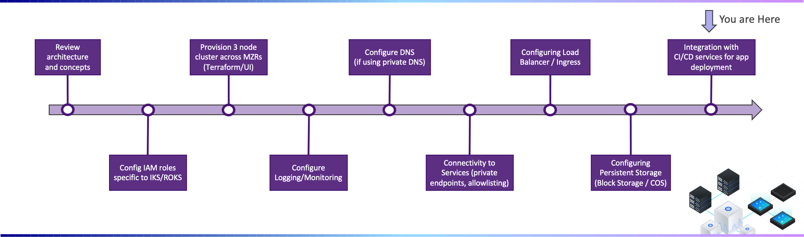

---

copyright:
  years: 2022, 2023
lastupdated: "2022-07-06"

subcollection: cloud-native-journey

---

{{site.data.keyword.attribute-definition-list}}

# Configure CI/CD services for app deployment
{: #cloud-native-roks-ci-cd}

Continuous integration (CI) can help you detect errors early, ensure early system integration, and improve collaboration in your development process.

Continuous delivery (CD) is a practice by which you build and deploy your software so that it can be released into production at any time. By automating your continuous integration and delivery processes through setting up CI/CD pipelines, you can achieve repeatability in code releases and greater predictability in delivery schedules.

## Journey Map
{: #cloud-native-roks-ci-cd-map}

{: class="center"}

## Setting up continuous integration and delivery
{: #cloud-native-roks-ci-cd-setup}

To add a continuous delivery pipeline to your cluster,

1. From the [{{site.data.keyword.redhat_openshift_notm}} clusters console](https://{DomainName}/kubernetes/clusters?platformType=openshift), select the cluster for which you want to set up a continuous delivery pipeline.
2. Select the **DevOps** tab.
3. Click on **Create a toolchain**.
4. Review the available toolchains. {{site.data.keyword.IBM_notm}} provides pre-defined toolchains that you can use to deploy, test, and monitor Kubernetes-native apps or Helm charts. You can expand each toolchain to find an overview of the tools that are set up for you and to find the scripts in GitHub that are used to configure the toolchain in your cluster. For more information about each toolchain, see [Toolchain templates](/docs/ContinuousDelivery?topic=ContinuousDelivery-cd_about#templates). If you know what tools you want to use, you can create your own toolchain.
5. Select the toolchain that you want to use and click **Create**.
6. Follow the directions in the console to configure your toolchain. Make sure to include the name of your cluster in your toolchain name so that you can easily find the toolchain that is associated with your cluster later. For more information, see [Creating toolchains](/docs/ContinuousDelivery?topic=ContinuousDelivery-toolchains_getting_started).
7. Select **Delivery Pipeline** to review the stages of your continuous integration and continuous delivery pipeline. After you create your toolchain, your pipeline is automatically kicked off and runs through the stages that you configured. Make sure that your stages run successfully and correct any errors.
8. Modify your toolchain. You can add more tools to your toolchain or change the stages of your delivery pipeline.
    1. From the [{{site.data.keyword.redhat_openshift_notm}} clusters console](https://{DomainName}/kubernetes/clusters?platformType=openshift){: external}, select the cluster for which you want to set up a continuous delivery pipeline.
    2. Select the **DevOps** tab.
    3. Select the toolchain that you want to modify.

    Having trouble finding the toolchain that you configured for your cluster? If one of the stages in your continuous delivery pipeline fails, the toolchain does not show in the **DevOps** tab of your cluster. Make sure to review errors in your pipeline by selecting your toolchain from the [{{site.data.keyword.contdelivery_short}} dashboard](https://{DomainName}/devops/toolchains) directly.
    {: tip}

## Additional content
{: #cloud-native-roks-ci-cd-additional}

- To automate your CI/CD pipeline, check out the following supported [integrations and tools](https://{DomainName}/docs/openshift?topic=openshift-cicd#cicd_strategy).

  - Codeship
  - Grafeas
  - {{site.data.keyword.deliverypipelinelong}}
  - Helm
  - Kustomize
  - Operators
  - Razee

- For a deep dive into the benefits and specifics of automating continuous integration and delivery, check out [Automate continuous integration](https://www.ibm.com/garage/method/practices/code/practice_continuous_integration) and [Build and deploy by using continuous delivery](https://www.ibm.com/garage/method/practices/deliver/practice_continuous_delivery) in the {{site.data.keyword.IBM_notm}} Garage Methodology documentation.

## What's next
{: #cloud-native-roks-ci-cd-what-next}

- Understanding [high availability and disaster recovery for {{site.data.keyword.containerfull_notm}}](https://{DomainName}/docs/containers?topic=containers-ha)
- [Enhance your cluster with extra and open-source capabilities](https://{DomainName}/docs/containers?topic=containers-managed-addons)
- [Adding complex Kubernetes apps to your cluster by using Helm charts](https://{DomainName}/docs/containers?topic=containers-helm)
- [Planning app deployments for high availability](https://{DomainName}/docs/containers?topic=containers-plan_deploy)